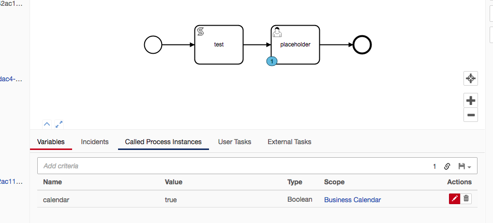

# Camunda and Business Days/Hours Calendar

Business Calendar Libraries:
- https://github.com/dhatim/business-hours-java (backup: https://github.com/StephenOTT/business-hours-java)
- https://github.com/olejnikk/bizdays (backup: https://github.com/StephenOTT/bizdays)

----

JavaDocs:

- org.dhatim.businesshours: http://www.javadoc.io/doc/org.dhatim/business-hours/1.0.0

----

**Required: Java 8**

Uses Camunda 7.8.

----

Nashorn Javascript Script Example for determining if current Local DateTime is within Business Hours

```javascript
with (new JavaImporter(org.dhatim.businesshours, java.time))
{
    var businessHours = new BusinessHours("wday{Mon-Fri} hour{9am-6pm}, wday{Sat} hour{9am-12pm}");
    var open = businessHours.isOpen(LocalDateTime.now());
}
execution.setVariable('calendar', open)
```

Dockerfile:

```dockerfile
FROM camunda/camunda-bpm-platform:tomcat-7.8.0

# add custom configurations
COPY docker/camunda/conf/ /camunda/conf

# Copy third-party Java libraries
COPY docker/camunda/lib/* /camunda/lib/
```


