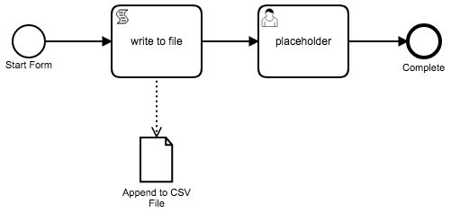
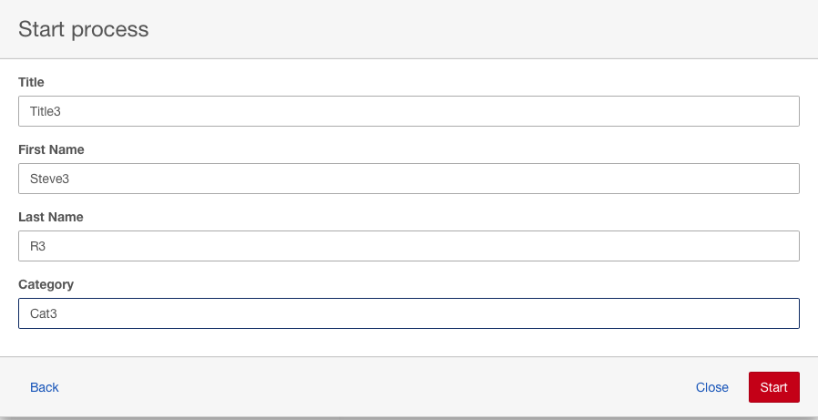

# CSV Writer



Uses the Apache Commons CSV writer to append rows to a CSV file.

The Start Event has a embedded form with 4 fields: `firstName`, `lastName`, `title`, `category`.

## Input Form:



## CSV Output


# Docker setup 

You will require a volume mapping for the location of the common CSV file.

See the docker-compose.yml file and line:

```yaml
    volumes:
      - /path/to/the/csv/folder:/csv_files
```

Update the path on the left of the `:` with your local path.  Can be set in the Docker For Windows/Mac Settings UI.

Place a output.csv file in the csv_files folder.

To run: `docker-compose up`

once running you can deploy the BPMN file and the csv-writer.js file through the rest api (localhost:8080/engine-rest).

You can vist the Camunda web apps at: localhost:8080/camunda

# csv-writer.js

```javascript
var Files = Java.type('java.nio.file.Files')
var Paths = Java.type('java.nio.file.Paths')
var CSVPrinter = Java.type('org.apache.commons.csv.CSVPrinter')
var CSVFormat = Java.type('org.apache.commons.csv.CSVFormat')
var StandardOpenOption = Java.type('java.nio.file.StandardOpenOption')

var firstName = execution.getVariable('firstName')
var lastName = execution.getVariable('lastName')
var title = execution.getVariable('title')
var category = execution.getVariable('category')

var csvPath = "/csv_files/output.csv";
var writer = Files.newBufferedWriter(Paths.get(csvPath), StandardOpenOption.APPEND);

// Example of adding a header row.
// Make sure to add logic for detecting header row and not adding the header row on subsequent appends
// Simple workaround is to just make sure the first row is always included in your CSV file.
// var csvPrinter = new CSVPrinter(writer, CSVFormat.DEFAULT.withHeader("First", "Last", "Title", "Category"));

var csvPrinter = new CSVPrinter(writer, CSVFormat.DEFAULT);

// If you have multiple records to add to the csv, 
// you can loop through this line:
csvPrinter.printRecord(firstName, lastName, title, category);

csvPrinter.flush();
writer.flush();
writer.close();
csvPrinter.close();
```