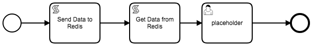

# Camunda with Scriptable Redis connection through jdis

An example of Getting and Sending data to a Redis database.

Uses [Jedis](https://github.com/xetorthio/jedis) which is [copied](https://github.com/DigitalState/camunda-variations/blob/master/jdis-redis/Dockerfile#L7) into the Camunda deployment.

Redis is deployed as part of the docker-compose [file](https://github.com/DigitalState/camunda-variations/blob/master/jdis-redis/docker-compose.yml#L12-L19) as the `redisdb` service.  This service name is what acts as the domain to access the redis instance.

Example: in the `sendRedis.js` [file](https://github.com/DigitalState/camunda-variations/blob/master/jdis-redis/bpmn/sendRedis.js#L2) which is used as the example creating a key/value in redis, the following line:

```javascript
...
var jedis = new Jedis("redisdb")
...
```

The `"redisdb"` is the equivalent to calling `var jedis = new Jedis("localhost")`.
See documentation on docker-compose service names and networks.

# Example of Camunda Cockpit after executing the BPMN




# How to Run:

1. cd into the this directory
1. run `docker-compose up --build`
1. Camunda and Redis will startup
1. Once camunda is fully deployed, you will be able to access the camunda rest api through `localhost:8055/engine-rest`.  You can access the UIs through `localhost:8055/camunda`. 
1. Deploy through the rest api, the .BPMN and two .js files in the `./docs/bpmn` folder.
1. Through the Tasklist UI, run the "Put-Get Redis" process definition.